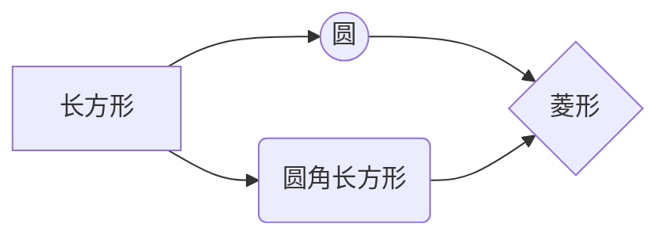

# CSDN Markdown 编辑器语法速查

> 整理自 CSDN Markdown 编辑器官方说明。写 CSDN 文章时按此使用 CSDN 特有 / 支持的语法。
> **前提**:发布必须用 CSDN Markdown 编辑器(非富文本编辑器)并切到**源码模式**,否则以下语法全部失效、以纯文本显示。

---

## 1. 标题与目录

- `#` 后**必须按空格**再写标题文字,支持 1~6 级(`#` ~ `######`)
- `@[toc]` 生成自动目录(依据标题层级)

## 2. 文本样式

| 写法 | 效果 | 是否 CSDN 特有 |
| :--- | :--- | :--- |
| `*斜体*` 或 `_斜体_` | 斜体 | 否 |
| `**粗体**` 或 `__粗体__` | 粗体 | 否 |
| `==标记==` | 高亮标记 | **是** |
| `~~删除~~` | 删除线 | 否 |
| `> 引用` | 引用块 | 否 |
| `H~2~O` | 下标 H₂O | **是** |
| `2^10^` | 上标 2¹⁰ | **是** |

## 3. 链接与图片

- 链接:`[文字](url)`
- 图片:``
- 带尺寸:``
- 居中:``
- 居中且带尺寸:``
- 支持本地图片直接拖拽到编辑区上传

## 4. 代码块

- **必须标语言**才有高亮:` ```javascript ` ` ```python ` ` ```bash ` ` ```text `
- 高亮样式在「博客设置 -> 代码片样式」里选
- mermaid 图也用代码块,语言标 `mermaid`(见第 11 节)

## 5. 列表

- 无序:`- 项目`(缩进可嵌套子项)
- 有序:`1. 项目`
- 检查列表:`- [ ] 未完成` / `- [x] 已完成`

## 6. 表格

简单表格(首尾 `|` 可省):

```text
项目 | Value
---- | -----
电脑 | $1600
```

对齐用冒号:

- `:---------:` 居中
- `:----------` 居左
- `----------:` 居右

完整写法:

```text
| 第一列 | 第二列 | 第三列 |
| :---: | ---: | :--- |
| 居中 | 居右 | 居左 |
```

## 7. 定义列表(CSDN 特有)

```text
Markdown
:  Text-to-HTML conversion tool

Authors
:  John
:  Luke
```

## 8. 注脚

```text
正文中需要注脚的位置写标记[^1]。

[^1]: 注脚的解释内容。
```

## 9. 缩写注释(CSDN 特有)

文中出现该词会自动悬浮显示标题说明:

```text
本文用到了 HTML 语法。

*[HTML]: 超文本标记语言
```

## 10. 数学公式(KaTeX)

- 行内:`$...$`
- 块级:`$$ ... $$`(独占行)

```text
$\Gamma(n) = (n-1)!\quad\forall n\in\mathbb N$
```

## 11. Mermaid 图表(代码块标 `mermaid`)

- 甘特图:代码块内首行 `gantt`
- 序列图:首行 `sequenceDiagram`
- 流程图:首行 `graph LR`(或 TD)
- flowchart:首行 `flowchat`

示例:

````text

````

## 12. 快捷键(用 `<kbd>` 标签)

| 操作 | 快捷键 |
| :--- | :--- |
| 加粗 | <kbd>Ctrl/Command</kbd> + <kbd>B</kbd> |
| 斜体 | <kbd>Ctrl/Command</kbd> + <kbd>I</kbd> |
| 标题 | <kbd>Ctrl/Command</kbd> + <kbd>Shift</kbd> + <kbd>H</kbd> |
| 插入代码 | <kbd>Ctrl/Command</kbd> + <kbd>Shift</kbd> + <kbd>K</kbd> |
| 插入链接 | <kbd>Ctrl/Command</kbd> + <kbd>Shift</kbd> + <kbd>L</kbd> |
| 插入图片 | <kbd>Ctrl/Command</kbd> + <kbd>Shift</kbd> + <kbd>G</kbd> |
| 撤销 / 重做 | <kbd>Ctrl/Command</kbd> + <kbd>Z</kbd> / <kbd>Y</kbd> |
| 查找 / 替换 | <kbd>Ctrl/Command</kbd> + <kbd>F</kbd> / <kbd>G</kbd> |

---

## 导入 / 导出

- **导出**:编辑器工具栏「文章导出」-> `.md` 或 `.html` 本地保存
- **导入**:工具栏「导入」选择本地 `.md` 文件加载继续编辑
